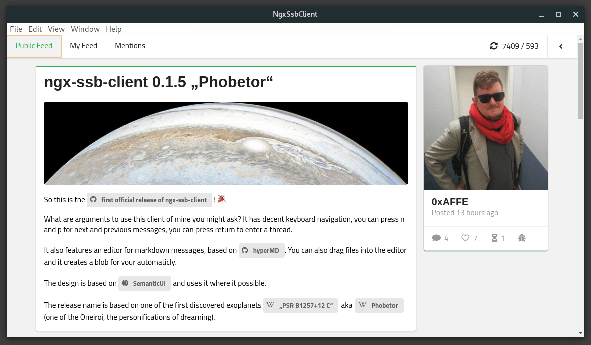

# ngx-ssb-client
> [secure scuttlebutt](https://www.scuttlebutt.nz/) client using „modern“ web development technologies.

[](https://gitlab.com/datenknoten/ngx-ssb-client/commits/develop)  



ngx-ssb-client is an approach to the secure scuttlebutt network using „modern“ technologies like [angular](https://angular.io/), [ngxs](https://github.com/ngxs/store) and [semantic ui](https://semantic-ui.com/).

## Installation

If you want to give it a try checkout the [release page](https://github.com/datenknoten/ngx-ssb-client/releases)

## Development setup

You want to dive into the internals? Please do so! ngx-ssb-client uses a loose interpretation of [git flow](https://danielkummer.github.io/git-flow-cheatsheet/), so feel free to submit pull requests, I'm more than happy to review and incorporate them!

If you have the luxury to be able to use [nvm](https://github.com/creationix/nvm) I highly recommend it to you to use it.

So to get started punsh these incantation into your shell and start hacking:

```
$ nvm use # only if you have nvm installed
$ npm i
$ npm run start
```
